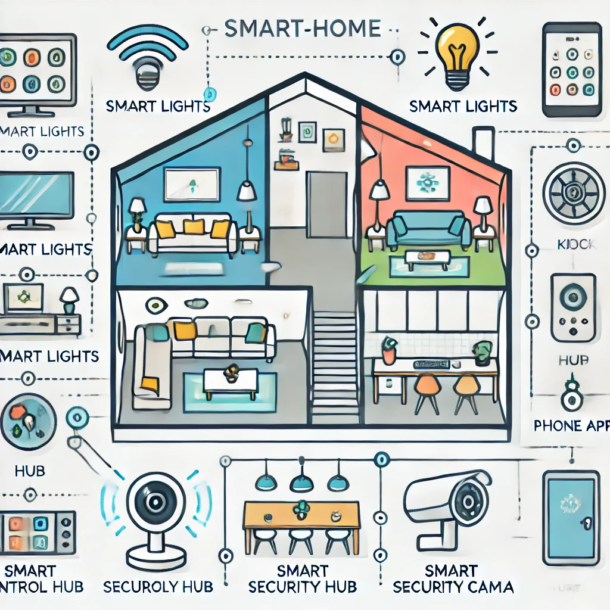

# Smart Home Automation

Welcome to my **Smart Home Automation** repository! This project is a collection of various smart home features that I'm developing to automate and improve everyday tasks around the house. Right now, the repo includes two projects:

- **Light Control**: A Python script to control my LIFX smart light with a clap detector.
- **YOLO Security Camera**: A security camera system that detects squirrels (and potentially people) on my porch and takes action.

I plan to add more projects over time, so feel free to explore the repo and follow along as it grows!

## Features

### 1. **Light Control**
Control LIFX smart lights using a clap detector for easy hands-free activation.

<!--   Replace with a relevant image -->

### 2. **YOLO Security Camera**
A camera system that detects squirrels in real time using YOLOv8 and triggers a buzzer to scare them away. Eventually, this will detect people and send notifications.

<!--   <!-- Replace with a relevant image -->

## How to Use
Each project has its own folder and setup instructions. For specific installation and usage, refer to the README in each project folder:

- [Light Control](./light-control/README.md)
- [YOLO Security Camera](./yolo-security-camera/README.md)

## Future Plans
Some features I hope to add in the future:
- Motion sensors
- Smart thermostat integration
- Home security notifications

Feel free to contribute or suggest ideas!
